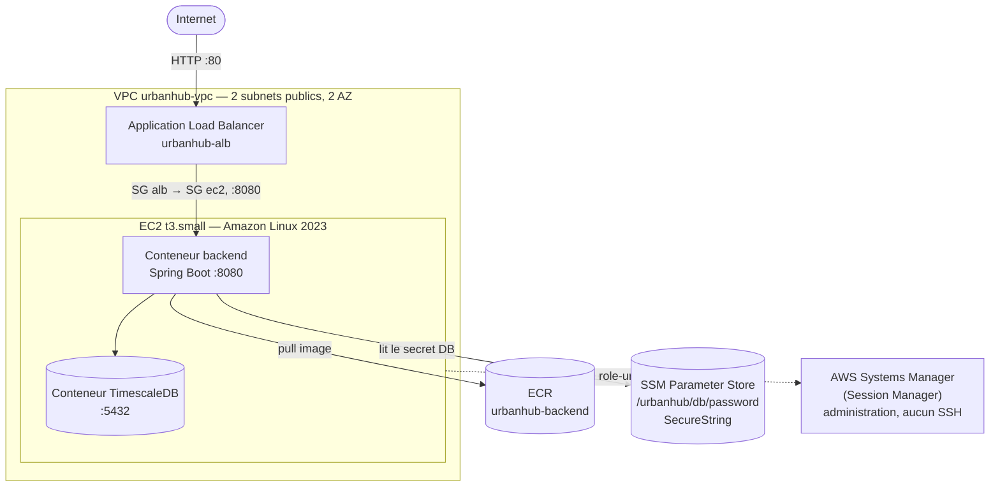
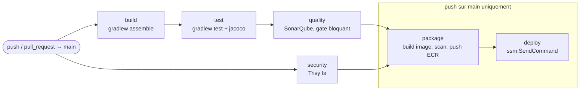
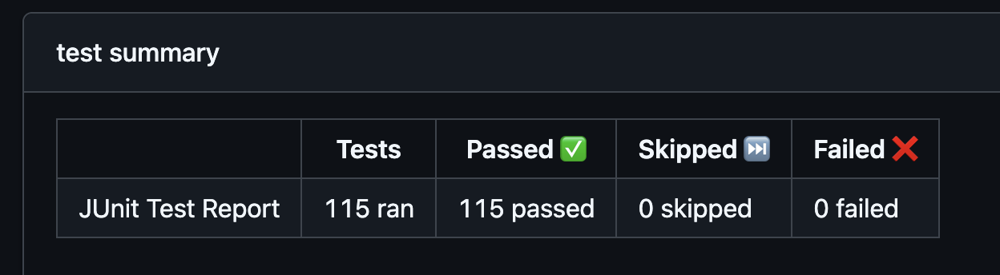
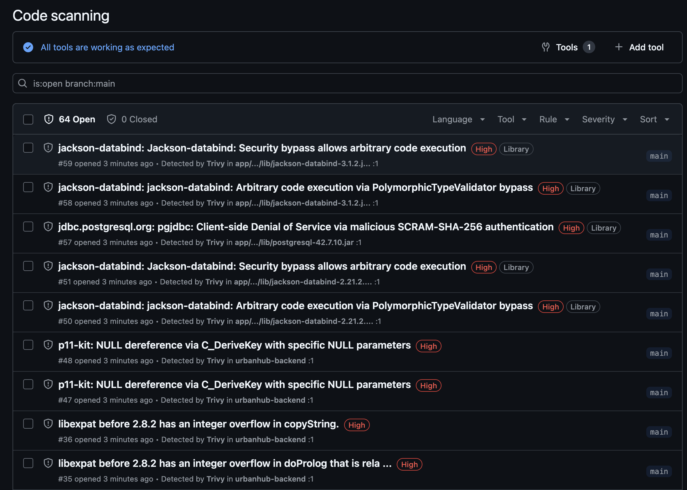
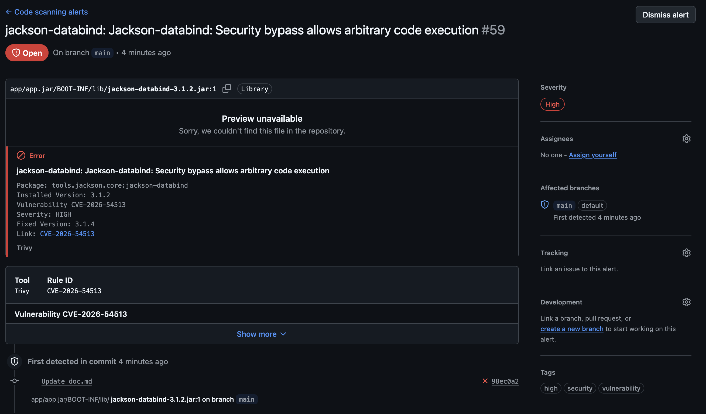

# Documentation technique — UrbanHub

Documentation et justification des choix techniques pour l'industrialisation
(CI/CD), le déploiement cloud et la sécurisation du backend UrbanHub.

- **Projet** : UrbanHub — plateforme de capteurs smart-city (backend Spring
  Boot / Java / Gradle, base TimescaleDB, ingestion MQTT + HTTP).
- **Cloud** : AWS, région `eu-west-3` (Paris).
- **IaC** : Terraform (≥ 1.9).

> La **procédure de déploiement** pas-à-pas est dans un fichier séparé,
> [`infra/README.md`](infra/README.md). Le présent document explique
> **pourquoi** ces choix, pas seulement **comment** déployer.

| Domaine | Périmètre | État |
|---|---|---|
| Infrastructure cloud | VPC, EC2, ALB, ECR, IAM, secrets, IaC | Réalisée, infra active |
| Sécurité | Risques, durcissement, supervision | Analyse de risques + supervision faites ; une vulnérabilité critique (API sans authentification) documentée mais volontairement non corrigée |
| Pipeline CI/CD | build/test/qualité/sécurité/déploiement | Workflow écrit, pas encore exécuté en conditions réelles |

---

## Sommaire

- [1. Infrastructure cloud](#1-infrastructure-cloud)
  - [1.1 Architecture générale](#11-architecture-générale)
  - [1.2 Organisation de l'IaC — 3 modules Terraform](#12-organisation-de-liac--3-modules-terraform)
  - [1.3 Choix d'architecture et justifications](#13-choix-darchitecture-et-justifications)
    - [EC2 + `docker compose`, pas ECS/Fargate/Kubernetes](#ec2--docker-compose-pas-ecsfargatekubernetes)
    - [TimescaleDB en conteneur, pas RDS](#timescaledb-en-conteneur-pas-rds)
    - [Subnets publics + Security Groups, sans NAT Gateway](#subnets-publics--security-groups-sans-nat-gateway)
    - [Administration et déploiement par SSM, pas SSH](#administration-et-déploiement-par-ssm-pas-ssh)
  - [1.4 IAM — identités et accès](#14-iam--identités-et-accès)
    - [OIDC plutôt qu'une clé d'accès statique dans le CI](#oidc-plutôt-quune-clé-daccès-statique-dans-le-ci)
    - [Le rôle CI n'a aucun droit IAM](#le-rôle-ci-na-aucun-droit-iam)
    - [Moindre privilège appliqué partout](#moindre-privilège-appliqué-partout)
  - [1.5 Gestion des secrets](#15-gestion-des-secrets)
  - [1.6 Analyse performances / coût](#16-analyse-performances--coût)
  - [1.7 Corrections apportées lors de la mise en place du pipeline CI/CD](#17-corrections-apportées-lors-de-la-mise-en-place-du-pipeline-cicd)
  - [1.8 Vérifications effectuées](#18-vérifications-effectuées)
- [2. Sécurité](#2-sécurité)
  - [2.1 Analyse et classification des risques](#21-analyse-et-classification-des-risques)
  - [2.2 Mesures de sécurité déjà en place](#22-mesures-de-sécurité-déjà-en-place)
  - [2.3 Plan de supervision](#23-plan-de-supervision)
  - [2.4 Le risque non corrigé : API totalement ouverte (R1 + R2)](#24-le-risque-non-corrigé--api-totalement-ouverte-r1--r2)
- [3. Pipeline CI/CD (workflow écrit, non encore exécuté en réel)](#3-pipeline-cicd--workflow-écrit-non-encore-exécuté-en-réel)
  - [3.1 Outils mobilisés et raisons de leur sélection](#31-outils-mobilisés-et-raisons-de-leur-sélection)
  - [3.2 Découpage en 6 jobs](#32-découpage-en-6-jobs)
  - [3.3 Authentification AWS : OIDC, pas de secret statique](#33-authentification-aws--oidc-pas-de-secret-statique)
  - [3.4 Artefact déployable : `Dockerfile.prod`](#34-artefact-déployable--dockerfileprod)
  - [3.5 Sécurité (DevSecOps) dans le pipeline](#35-sécurité-devsecops-dans-le-pipeline)
  - [3.6 Déploiement sans SSH, instance retrouvée dynamiquement](#36-déploiement-sans-ssh-instance-retrouvée-dynamiquement)
  - [3.7 Prérequis (secrets et variables GitHub)](#37-prérequis-secrets-et-variables-github)
  - [3.8 Interprétation des résultats produits](#38-interprétation-des-résultats-produits)
  - [3.9 Limites et pistes d'amélioration (spécifiques au pipeline, contexte production)](#39-limites-et-pistes-damélioration-spécifiques-au-pipeline-contexte-production)
- [Limites connues et pistes d'amélioration (transverses)](#limites-connues-et-pistes-damélioration-transverses)
- [Retour d'expérience sur l'usage des outils d'assistance (IA)](#retour-dexpérience-sur-lusage-des-outils-dassistance-ia)

---

## 1. Infrastructure cloud

### 1.1 Architecture générale

### 1.2 Organisation de l'IaC — 3 modules Terraform

| Module | Rôle | State |
|---|---|---|
| `infra/terraform/bootstrap` | Crée le bucket S3 du state | Local (fichier) |
| `infra/terraform/iam` | OIDC, groupes, rôles | S3 `iam/` |
| `infra/terraform/app` | VPC, SG, EC2, ALB, ECR, SSM | S3 `app/` |

**Pourquoi découper ?** Séparer les domaines de changement : on ne rejoue pas
tout l'IAM pour modifier une règle réseau, et une erreur dans `app` ne peut pas
corrompre le state IAM.

### 1.3 Choix d'architecture et justifications

#### EC2 + `docker compose`, pas ECS/Fargate/Kubernetes
Le backend tourne déjà en `docker compose` en local. Le reproduire sur une EC2
est le chemin le plus court: aucune abstraction nouvelle à apprendre. ECS/EKS apporteraient
l'autoscaling et un plan de contrôle managé, mais c'est du sur-dimensionnement
pour un service sans contrainte de charge actuelle. **Choix réversible** :
migrer vers ECS plus tard ne toucherait ni l'IAM ni l'image Docker.

#### TimescaleDB en conteneur, pas RDS
RDS PostgreSQL **ne supporte pas** l'extension TimescaleDB, dont dépend
l'`hypertable` du projet. Garder la base en conteneur (comme en local) préserve
la compatibilité et évite de réécrire la couche d'accès aux données. *Limite
assumée* : la base partage le sort de l'instance

#### Subnets publics + Security Groups, sans NAT Gateway
L'instance est dans un subnet public, mais **son Security Group n'autorise
aucune entrée depuis Internet** : seul l'ALB (SG distinct) atteint le port
8080. Le vrai contrôle d'accès est le SG, pas le placement réseau. Un subnet
privé + NAT Gateway ajouterait une défense en profondeur, mais le NAT coûte
~32 €/mois + trafic pour une seule instance : disproportionné.

#### Administration et déploiement par SSM, pas SSH
Aucune paire de clés SSH, aucun port 22 ouvert. L'accès shell passe par AWS
Systems Manager Session Manager (rôle `role-urbanhub-ec2` +
`AmazonSSMManagedInstanceCore`). Cela supprime toute la gestion des clés SSH et
la surface d'attaque associée. C'est le **même** mécanisme (SSM
`SendCommand`) que le pipeline CI utilisera pour déployer, en remplacement du
`ssh + SSH_PRIVATE_KEY` de l'ancien pipeline CI/CD on-premise.

### 1.4 IAM — identités et accès

Ressources créées :

| Ressource | But |
|---|---|
| Provider OIDC GitHub | Fédère l'identité de GitHub Actions vers AWS |
| Groupe `urbanhub-admin` | Contrôle complet **du projet** (pas admin AWS global) |
| Groupe `urbanhub-team` | Exploitation (start/stop) + lecture seule, sans IAM |
| Rôle `role-urbanhub-ci` | Assumé par le CI via OIDC — **aucun droit IAM** |
| Rôle `role-urbanhub-ec2` | Instance profile — lecture secrets, pull ECR, logs |

#### OIDC plutôt qu'une clé d'accès statique dans le CI
Une clé statique doit être stockée (donc peut fuiter), tourne rarement, et
reste valide même si le repo est compromis. Avec OIDC, GitHub Actions présente
un jeton signé, valable le temps du job, vérifié par AWS avant de délivrer des
credentials temporaires. Rien à stocker, rien à faire tourner.

#### Le rôle CI n'a aucun droit IAM
Le `role-urbanhub-ci`
ne sait faire que deux choses : pousser une image sur *un* repo ECR précis, et
déclencher un déploiement SSM sur *les* instances taguées `Project=urbanhub`.
Les changements d'IAM restent appliqués manuellement par un admin humain, jamais depuis le pipeline. On sépare volontairement
« déployer l'appli » (auto, risque contenu) de « changer les droits » (manuel,
revu).

#### Moindre privilège appliqué partout
Chaque policy est scopée par tag `Project=urbanhub` ou par préfixe de ressource
`urbanhub-*` / path `/urbanhub/`. `Resource: "*"` n'est utilisé que pour les
actions qui ne supportent structurellement pas le scoping
(`ecr:GetAuthorizationToken`, `ssm:GetCommandInvocation`…).

### 1.5 Gestion des secrets
Le mot de passe de la base est **généré** par Terraform (`random_password`) et
stocké en `SecureString` dans SSM Parameter Store. L'instance le lit au
démarrage via son rôle, l'écrit dans un `.env` en `chmod 600`, et l'injecte aux
conteneurs par `env_file`. Il n'apparaît jamais dans le code, le
`docker-compose.yml` déployé ou un script versionné.

### 1.6 Analyse performances / coût

| Ressource | Détail | ~ €/mois |
|---|---|---|
| EC2 `t3.small` | 2 vCPU, 2 Go, 24/7 | ~15 € |
| Volume EBS gp3 | 20 Go | ~1,7 € |
| Application Load Balancer | 1 ALB, LCU faible | ~18-20 € |
| ECR | stockage images (<1 Go) | ~0,1 € |
| SSM Parameter Store | Standard | gratuit |
| S3 (state Terraform) | quelques Ko | ~0 € |
| **Total estimé** | | **~35-40 €/mois** |

**Performances** : `t3.small` (2 Go) plutôt que `t3.micro` (1 Go) car la JVM et
TimescaleDB cohabitent sur la même machine — 1 Go serait à risque d'OOM. Les T3
sont « burstable », adaptés à des pointes ponctuelles. Si l'ingestion MQTT
devient continue : passer à une famille `m` ou séparer la base.

### 1.7 Corrections apportées lors de la mise en place du pipeline CI/CD

En construisant le pipeline CI/CD, deux choix initiaux se sont révélés
incompatibles avec un déploiement continu :

- **ECR `IMMUTABLE` → `MUTABLE`** (`infra/terraform/app/ecr.tf`) : un repo
  ECR `IMMUTABLE` interdit de re-pousser un tag déjà existant. Le déploiement
  pull `:latest`, qui doit justement être réécrit à chaque build : les deux
  étaient incompatibles (le tout premier push aurait réussi, tous les
  suivants auraient échoué). Passé en `MUTABLE`, avec double tag `:latest` +
  `:<git-sha>` pour conserver une traçabilité par build malgré tout.
- **`role-urbanhub-ci` : ajout de `ec2:DescribeInstances`**
  (`infra/terraform/iam/iam-role-ci.tf`) : nécessaire pour que le job
  `deploy` retrouve l'instance cible par tag plutôt que par un ID en dur.
  Action de lecture seule, `Resource: "*"` (ne supporte pas le scoping —
  cohérent avec le reste des permissions "descriptives" déjà accordées ailleurs).

### 1.8 Vérifications effectuées
- IAM validé avec `aws iam simulate-principal-policy` : le rôle CI ne peut pas
  créer d'utilisateur IAM (`implicitDeny`), peut pousser sur `urbanhub-backend`
  mais pas sur un autre repo (`implicitDeny`) ; `urbanhub-team` ne peut jamais
  terminer une instance (`explicitDeny`).
- Instance : `running`, enregistrée dans SSM (`Online`) → administration sans
  SSH opérationnelle.
- Conteneur TimescaleDB : `Up (healthy)`.
- Sécurité réseau testée depuis l'extérieur : ports 5432 (DB) et 8080 (direct)
  filtrés ; ALB joignable en HTTP.

---

## 2. Sécurité

### 2.1 Analyse et classification des risques

Échelle : Impact et Probabilité cotés Faible / Moyen / Élevé. Gravité =
croisement des deux, sert à prioriser.

| # | Risque | Catégorie | Source | Impact | Probabilité | Gravité | Mitigation en place | Résiduel |
|---|---|---|---|---|---|---|---|---|
| R1 | Écriture non authentifiée sur l'API (`ZoneController` CRUD complet, `POST /ingest/measures`) | Application | N'importe qui sur Internet | Élevé | **Critique** | Aucune | **Non traité — voir § 2.4** |
| R2 | CORS `allowedOriginPattern("*")` + `allowedMethod("*")` sur `/api/**` | Application | Site tiers, via le navigateur d'un visiteur | Élevé | Élevé | **Critique** | Aucune | **Non traité — voir § 2.4** |
| R3 | Mosquitto `allow_anonymous true` | Application/Réseau | Accès réseau au port 1883 | Moyen | Faible aujourd'hui — deviendrait Élevé si MQTT était exposé publiquement | Faible | MQTT non exposé dans le déploiement cloud | À traiter avant toute exposition MQTT publique (`allow_anonymous false` + credentials par capteur) |
| R4 | Mot de passe par défaut en clair dans `application-production.properties` (`spring.datasource.password=urbanhub`) | Application/Config | Lecture du repo Git | Moyen | Faible en prod cloud, réelle si ce profil tourne sans cette variable | Faible | Écrasé par variable d'environnement dans le déploiement (§ 1.5) | Correctif recommandé (retirer la valeur en dur) non appliqué |
| R5 | Pas de HTTPS entre client et ALB | Réseau | Interception sur le trajet Internet → ALB | Moyen | Élevé | Moyen | Aucune (pas de nom de domaine/certificat disponible) | Amélioration identifiée (Limites transverses, point 2) |
| R6 | Instance EC2 unique, une seule AZ | Infra/Continuité | Panne matérielle/AZ | Moyen | Faible-Moyen | Moyen | Alarme `urbanhub-instance-status-check-failed` (détection, pas de bascule auto) | Détecté, non auto-résolu |
| R7 | Base TimescaleDB non sauvegardée | Infra/Intégrité | Corruption disque, erreur d'exploitation | Élevé | Faible | Moyen | Volume EBS chiffré, pas de snapshot planifié | Amélioration identifiée |
| R8 | Dépendances/image avec vulnérabilités connues | Application/Supply chain | Bibliothèques tierces (Gradle, image de base) | Variable | Concrétisé une fois : le gate a bloqué un premier build (Tomcat embarqué + Spring Boot, 4 CVE CRITICAL) | — | Trivy (fs + image), gate bloquant sur `CRITICAL`, SARIF publié (§ 3.6) — corrigé par bump Spring Boot `4.0.6` + override `tomcat.version=11.0.22` (`build.gradle`) | Faible (scan automatisé à chaque build, a déjà prouvé son utilité) |
| R9 | Élévation de privilèges via la CI ou l'instance compromise | Infra/Accès | Pipeline ou instance compromis | Élevé | Faible | Moyen | IAM moindre privilège, rôle CI sans droit IAM, pas de SSH, OIDC (§ 1.4) | Faible |
| R10 | Fuite du bucket de state Terraform (contient le mot de passe DB généré, en clair dans le state) | Infra/Secrets | Accès au bucket S3 | Élevé si exposé | Faible (chiffré, non public, accès refusé explicitement à `urbanhub-team`) | Faible | Chiffrement SSE-S3, `aws_s3_bucket_public_access_block`, deny explicite (§ 1.4) | Faible |

Les deux risques **Critiques** (R1, R2) sont regroupés et traités à part en
§ 2.4 : c'est le point le plus grave du dossier, il mérite une explication
détaillée plutôt qu'une ligne de tableau.

### 2.2 Mesures de sécurité déjà en place

| Exigence | Mesure en place |
|---|---|
| Réduire la surface d'exposition | Security Groups : seul l'ALB atteint le backend ; DB jamais exposée ; pas de port SSH |
| Protéger les données sensibles | Secret DB généré + SSM SecureString, jamais en clair dans le repo |
| Gestion des accès (moindre privilège) | Groupes/rôles IAM scopés par tag/ARN ; rôle CI sans droit IAM |
| Sécurité dans le cycle de vie | Auth CI par OIDC (pas de clé statique) ; state chiffré ; scan Trivy à chaque build (§ 3.6) |
| Détection de mauvaises pratiques | Deny explicite du groupe `team` sur le bucket de state ; audit du code applicatif (§ 2.1, R1-R4) |

### 2.3 Plan de supervision

Infra : [`infra/terraform/app/monitoring.tf`](infra/terraform/app/monitoring.tf).

| Élément | Détail |
|---|---|
| Logs applicatifs | Conteneurs `backend` et `db` configurés avec le driver Docker `awslogs`, groupe CloudWatch `/urbanhub/app`, rétention 14 jours |
| Alarme disponibilité instance | `StatusCheckFailed` (namespace `AWS/EC2`), période 300s/2 évaluations — alignée sur le monitoring basique (5 min), pas le détaillé (payant) |
| Alarme cible ALB | `UnHealthyHostCount` ≥ 1 sur 3 périodes de 60s |
| Alarme erreurs serveur | `HTTPCode_Target_5XX_Count` ≥ 10 sur 5 min |
| Notification | Topic SNS `urbanhub-alerts` + abonnement email (`var.alert_email`, valeur générique par défaut à remplacer avant exploitation) |

**Bug rencontré et corrigé pendant la mise en œuvre** : l'option Docker
`awslogs-stream-prefix` n'existe pas pour
le driver `awslogs` standalone de Docker Engine — elle faisait échouer la
création du conteneur `db` au démarrage, avec `set -euxo pipefail` bloquant
tout le reste du script (la base ne démarrait même plus). Remplacée par
`awslogs-stream` (nom fixe par service). Un second bug lié (période d'alarme
à 60s incompatible avec le monitoring basique 5 min de l'instance) a été
corrigé dans la foulée — trouvé en vérifiant l'arrivée réelle des logs dans
CloudWatch après l'apply.

### 2.4 Le risque non corrigé : API totalement ouverte (R1 + R2)

**Constat.** Il n'y a aucune dépendance Spring Security dans le projet,
aucune annotation d'autorisation sur les contrôleurs. `ZoneController`
expose un CRUD complet (`GET`/`POST`/`PUT`/`DELETE`) et
`IngestMeasureController` accepte `POST /ingest/measures` sans aucune
vérification d'identité. La policy CORS du `WebConfig.java` autorise en plus
n'importe quelle origine et n'importe quelle méthode sur `/api/**` — la seule
protection un tant soit peu dissuasive (même origine) est donc elle-même
désactivée.

**Remédiation recommandée** :
- Restreindre `WebConfig` à une liste d'origines explicites, pas un wildcard.
- Ajouter `spring-boot-starter-security` avec une clé API exigée sur tous les
  `POST`/`PUT`/`DELETE`, stockée en SSM Parameter Store (même mécanisme que
  le mot de passe DB) — laisser les `GET` publics si c'est un choix produit
  assumé.
- Pour l'ingestion HTTP (`/ingest/measures`), une clé par capteur permettrait
  de révoquer un capteur compromis sans tout casser.

Point à traiter en priorité absolue avant toute mise en production réelle.

---

## 3. Pipeline CI/CD (workflow écrit, non encore exécuté en réel)

Workflow : [`.github/workflows/ci-cd.yml`](.github/workflows/ci-cd.yml).

### 3.1 Outils mobilisés et raisons de leur sélection

| Outil | Rôle dans le pipeline | Pourquoi celui-ci |
|---|---|---|
| GitHub Actions | Orchestrateur CI/CD | Plateforme du dépôt actuel ; runners hébergés gratuits, OIDC natif vers AWS sans configuration tierce |
| Gradle (wrapper `./gradlew`) | Build, tests, couverture | Déjà l'outil de build du projet (`build.gradle`) — aucun nouvel outil de build introduit |
| JaCoCo | Couverture de code | Plugin Gradle déjà configuré dans `build.gradle`, réutilisé tel quel |
| `mikepenz/action-junit-report` | Publication des résultats de tests en annotations lisibles | Action GitHub maintenue, lit directement le XML JUnit produit par Gradle — pas de reformatage de sortie à écrire soi-même |
| SonarQube (auto-hébergé) | Analyse de qualité + quality gate | Repris tel quel de l'ancien pipeline CI (plugin `org.sonarqube` déjà dans `build.gradle`) ; auto-hébergé pour rester cohérent avec l'existant plutôt que migrer vers SonarCloud sans raison |
| Trivy (`aquasecurity/trivy-action`) | Scan de vulnérabilités (dépendances + image) | Outil DevSecOps de référence, gratuit, sans compte à créer, sortie SARIF native compatible GitHub Security — évite d'ajouter un service tiers de plus pour une équipe déjà à outils limités |
| Docker / `Dockerfile.prod` | Production de l'artefact déployable | Artefact autonome et versionnable, cohérent avec le déploiement sur EC2 (§ 1.3) |
| `aws-actions/configure-aws-credentials` + `amazon-ecr-login` | Authentification AWS et connexion ECR | Actions officielles AWS, gèrent l'échange OIDC → credentials temporaires sans code custom |
| AWS SSM (`ssm:SendCommand`) | Déclenchement du déploiement | Déjà le mécanisme d'administration retenu pour l'infrastructure (pas de SSH, § 1.3) ; le pipeline réutilise le même canal plutôt que d'en ouvrir un nouveau |

### 3.2 Découpage en 6 jobs

| Job | Rôle | Dépend de | Sur quels événements |
|---|---|---|---|
| `build` | `./gradlew assemble` — reproductibilité du build | — | push + PR sur main |
| `test` | `./gradlew test jacocoTestReport`, résultats publiés en annotations | `build` | push + PR sur main |
| `quality` | Analyse SonarQube, quality gate bloquant | `test` | push + PR sur main |
| `security` | Scan de dépendances Trivy (SARIF + gate CRITICAL) | — (parallèle) | push + PR sur main |
| `package` | Build image Docker (`Dockerfile.prod`), scan, push ECR | `test`, `quality`, `security` | **push sur main uniquement** |
| `deploy` | Déclenchement du redéploiement via SSM | `package` | **push sur main uniquement** |

Le séquençage reproduit celui de l'ancien pipeline (build → test → qualité →
déploiement), en ajoutant un job `security` dédié et un job `package` distinct
du déploiement (produire l'artefact et le déployer sont deux responsabilités
différentes, avec des échecs de nature différente).

`package` et `deploy` ne tournent que sur push vers `main` : sur une pull
request, le code est construit, testé, analysé et scanné, mais aucune image
n'est publiée ni déployée — même logique de restriction par branche que dans
l'ancien pipeline CI.

### 3.3 Authentification AWS : OIDC, pas de secret statique

`package` et `deploy` assument `role-urbanhub-ci` (§ 1.4) via
`aws-actions/configure-aws-credentials`. Aucun `AWS_ACCESS_KEY_ID` /
`AWS_SECRET_ACCESS_KEY` en secret GitHub : la confiance vient de la condition
OIDC (dépôt + branche `main`), pas d'une clé qui pourrait fuiter. Seuls ces
deux jobs reçoivent la permission `id-token: write` — le reste du workflow
(`build`, `test`, `quality`, `security`) n'a aucun accès AWS.

### 3.4 Artefact déployable : `Dockerfile.prod`

Le `Dockerfile` existant ne produit **pas** d'artefact exécutable : il sert
uniquement au dev local, où `docker-compose.yml` lance `./gradlew bootRun`
(hot-reload). Pour la CI, un `Dockerfile.prod` dédié a été ajouté :
build multi-stage (`bootJar` dans un stage JDK, puis copie du jar dans un
stage **JRE** minimal), utilisateur non-root, `ENTRYPOINT` explicite. Séparer
les deux Dockerfile évite de complexifier le chemin de dev pour satisfaire un
besoin de prod.

Chaque build pousse **deux tags** sur la même image : `:latest` (mobile,
utilisé par le déploiement) et `:<git-sha>` (fixe, traçabilité/rollback). Ce
choix a nécessité de revenir sur une décision initiale : le dépôt ECR avait
été créé en `IMMUTABLE`, ce qui aurait interdit de re-pousser `:latest` à
chaque build — corrigé en `MUTABLE` (§ 1.7).

### 3.5 Sécurité (DevSecOps) dans le pipeline

- **Scan de dépendances** (job `security`, Trivy `fs`) et **scan de l'image**
  (job `package`, Trivy `image`, sur l'image buildée juste avant de la
  pousser sur ECR) suivent le même schéma en deux passes : un premier scan
  non bloquant (`CRITICAL,HIGH`) publie systématiquement son rapport complet
  au format SARIF dans l'onglet *Security → Code scanning* du repo, même si
  le job échoue ensuite ; un second passage, bloquant uniquement sur
  `CRITICAL`, fait échouer le pipeline. Les deux uploads SARIF sont
  distingués par catégorie (`trivy-fs` / `trivy-image`) pour rester
  consultables séparément. Sévérité `HIGH` remontée mais non bloquante — un
  pipeline qui bloque sur chaque `HIGH` finit par ne plus être regardé.
  Double contrôle avec le scan `scan_on_push` déjà configuré côté registre ECR.
- **Quality gate Sonar bloquant** : `sonar.qualitygate.wait=true` (déjà dans
  `build.gradle`) fait échouer la tâche Gradle — donc le job — si le gate est
  rouge, ce qui bloque `package`/`deploy` en aval.

### 3.6 Déploiement sans SSH, instance retrouvée dynamiquement

Le job `deploy` ne connaît **aucun ID d'instance en dur** : il interroge
`ec2:DescribeInstances` (tag `Project=urbanhub`, état `running`) pour trouver
sa cible, puis déclenche `/opt/urbanhub/redeploy.sh` via `ssm:SendCommand`
(script créé par le `user-data` Terraform, § 1.3, cf.
`infra/terraform/app/templates/user_data.sh.tpl`). Ce choix rend le pipeline
résilient à une recréation de l'instance (nouvel ID) sans toucher au workflow.
Le job **attend activement** le résultat de la commande SSM (jusqu'à 2 min) et
échoue explicitement si le redéploiement échoue côté instance — pas de faux
positif "commande envoyée = déploiement réussi".

### 3.7 Prérequis (secrets et variables GitHub)

| Nom | Type | Valeur |
|---|---|---|
| `SONAR_HOST_URL` | Secret | URL de l'instance SonarQube auto-hébergée (fournie séparément) |
| `SONAR_TOKEN` | Secret | Token d'analyse Sonar |

`AWS_ROLE_ARN` n'est **pas** un secret (c'est un identifiant, pas une
credential) : il est en dur dans le workflow (`env:`), assumable uniquement
depuis ce dépôt et cette branche grâce à la condition OIDC côté AWS.

**État temporaire** : le job `quality` est en `continue-on-error: true` — la
connexion à l'instance SonarQube auto-hébergée ne fonctionne pas encore
(joignable en `curl`, mais l'analyse échoue), donc un échec de ce job
n'empêche plus `package`/`deploy` de s'exécuter, le temps de résoudre le
problème côté serveur Sonar. À retirer dès que l'analyse passe.

### 3.8 Interprétation des résultats produits

Ce que doit regarder un pair technique quand un job échoue, et ce que ça
signifie concrètement :

| Job | Où regarder | Comment lire un échec |
|---|---|---|
| `build` | Log du job (onglet *Actions*) | Erreur de compilation — le code ne compile pas, rien d'autre à interpréter |
| `test` | Annotations directement sur le diff (ajoutées par `action-junit-report`) + artefact `test-and-coverage-reports` (rapport HTML complet + JaCoCo) | Un test rouge = régression fonctionnelle réelle, pas un flake présumé : le pipeline ne retry aucun test automatiquement |
| `quality` | Log du job pour le verdict quality gate ; détail complet (bugs, code smells, duplication, couverture par fichier) sur l'instance SonarQube elle-même (`SONAR_HOST_URL`), projet `UrbanHub` | Le job échoue **seulement** si le *quality gate* est rouge (seuils définis côté Sonar, pas dans le workflow) — un avertissement Sonar qui ne fait pas échouer le gate n'échoue pas le job |
| `security` | Onglet **Security → Code scanning alerts** du repo, catégorie `trivy-fs` (résultats SARIF complets, y compris `HIGH` non bloquant) ; log du job pour le détail du gate `CRITICAL` | Une `CRITICAL` fait échouer le job : identifier la dépendance concernée dans l'alerte, vérifier si un correctif existe (montée de version) avant de rouvrir une PR. Un `HIGH` visible dans Security mais job vert = à traiter mais pas bloquant |
| `package` | Onglet **Security → Code scanning alerts**, catégorie `trivy-image` + résumé de job (`GITHUB_STEP_SUMMARY`, tag de l'image publiée) | Même logique que `security`, appliquée à l'image finale plutôt qu'au code source — une vulnérabilité peut apparaître ici sans être apparue en amont si elle vient de l'image de base Docker |
| `deploy` | Résumé de job (instance ciblée, ID de commande SSM) ; en cas d'échec, le job affiche directement `StandardErrorContent` de la commande SSM dans le log | Un échec ici veut dire que la commande a bien été envoyée mais a échoué **sur l'instance** (ex : image introuvable, `docker compose` en erreur) — pas un problème réseau/permissions (sinon `send-command` lui-même aurait échoué plus tôt) |

**Résultats obtenus lors d'une exécution réelle du pipeline :**

*Job `test` : 115 tests exécutés, 115 passés, 0 échec.*

*Onglet **Security → Code scanning** : les alertes publiées par les jobs `security`/`package` (Trivy), navigables par sévérité, outil et branche. 64 alertes `High` ouvertes à date, essentiellement des dépendances tierces (`jackson-databind`, `pgjdbc`, `p11-kit`, `libexpat`) — non bloquantes (seul `CRITICAL` bloque le pipeline, § 3.5), mais à trier et corriger dans le temps.*

*Détail d'une alerte : package concerné, version installée, CVE, sévérité et version corrigée — assez d'information pour trancher un correctif sans quitter GitHub.*

### 3.9 Limites et pistes d'amélioration (spécifiques au pipeline, contexte production)

- **Pas d'environnement de staging.** `main` déploie directement et uniquement
  sur l'unique instance existante — aucune étape intermédiaire pour valider un
  changement avant qu'il n'atteigne l'environnement réel. Piste : un
  environnement `staging` (deuxième instance, ou même instance avec un port
  différent) devant lequel `main` passerait avant un déploiement manuel vers
  prod.
- **Pas de rollback automatisé.** Le double tag (`:latest` + `:<git-sha>`,
  § 3.5) rend un rollback *possible* — repousser manuellement l'ancien tag
  en `:latest`, ou adapter `redeploy.sh` pour accepter un tag en paramètre —
  mais rien dans le pipeline ne le déclenche automatiquement en cas de
  problème détecté après coup.
- **Pas de vérification post-déploiement dans le pipeline lui-même.** Le job
  `deploy` confirme que la commande SSM a réussi côté instance, pas que
  l'application répond correctement derrière l'ALB. La détection d'un
  déploiement cassé retombe sur les alarmes CloudWatch (§ 2.3), donc avec
  un délai (jusqu'à plusieurs minutes), pas sur le pipeline en temps réel. Piste :
  ajouter un `curl` sur `/actuator/health` via l'ALB à la fin du job `deploy`.
- **Pas de porte d'approbation manuelle avant prod.** Tout push sur `main` qui
  passe les gates automatiques (tests, qualité, sécurité) est déployé sans
  intervention humaine. Acceptable pour un projet à cette échelle, mais un
  environnement GitHub avec *required reviewers* serait la façon la plus
  simple de l'ajouter sans réécrire le pipeline.
- **Coupure de service pendant le déploiement.** `docker compose up -d
  backend` sur une instance unique implique un arrêt/redémarrage du conteneur
  — quelques secondes d'indisponibilité à chaque déploiement. Conséquence
  directe de l'architecture mono-instance retenue (§ 1.3), pas un choix
  propre au pipeline.
- **SonarQube auto-hébergé = point individuel de défaillance du pipeline.**
  Si l'instance Sonar est indisponible, le job `quality` échoue et bloque
  `package`/`deploy`, même si le code lui-même est sain. Compromis assumé du
  choix auto-hébergé plutôt que SonarCloud.

---

## Limites connues et pistes d'amélioration (transverses)

1. **API sans authentification (R1/R2, § 2.4)** : le risque le plus grave du
   projet, documenté et volontairement non corrigé faute de temps. Priorité
   absolue avant toute mise en production réelle.
2. **HTTP seulement** : pas de nom de domaine → pas de certificat ACM. En prod :
   domaine + ACM + listener HTTPS (443) + redirection 80→443.
3. **Pas de haute disponibilité** : une instance, une AZ pour le compute.
4. **Base non sauvegardée** : ajouter des snapshots EBS planifiés ou externaliser.
5. **Réseau à durcir** : subnet privé + NAT (ou VPC endpoints) si le budget le permet.
6. **MQTT anonyme** (`mosquitto.conf`) : sans risque tant que MQTT reste
   désactivé côté cloud, mais à corriger (auth par capteur) avant toute
   exposition publique du broker.

---

## Retour d'expérience sur l'usage des outils d'assistance (IA)

- **Apports** : accélération de l'écriture du Terraform et des policies IAM
  (syntaxe, ARN, conditions), et surtout aide à **expliciter les compromis**
  (NAT vs SG, EC2 vs ECS, RDS vs conteneur) plutôt qu'à produire du code brut.
- **Limites** : l'assistant ne connaît pas le contexte implicite (budget réel, périmètre attendu) — chaque décision structurante a dû
  être tranchée par moi, pas déléguée. Quelques détails techniques ont nécessité
  correction (descriptions de Security Group refusant les accents/apostrophes).
- **Posture adoptée** : validation systématique avant tout `apply` sur le compte
  réel, relecture des plans Terraform, et vérification effective du résultat
  (simulation IAM, tests réseau) plutôt que confiance aveugle. Le code n'a été
  retenu que quand j'en comprenais la justification.
